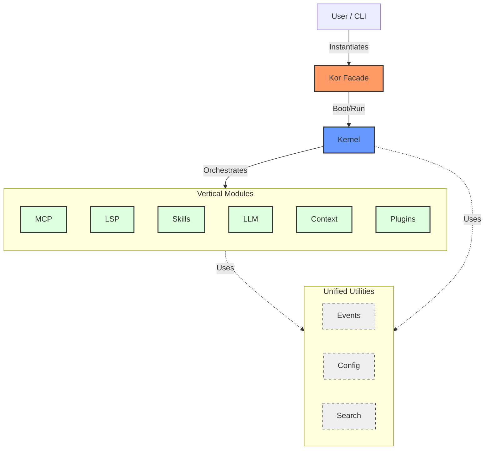

# KOR SDK Architecture

**Version:** 7.0 (Vertical Architecture)  
**Core Philosophy:** "Consolidated, Pythonic, Vertical."

## 1. High-Level Overview

The KOR SDK departs from traditional layered architectures (Controller, Service, Repository). Instead, it uses a **Vertical Architecture** where features are self-contained domains.

A "Vertical" (like `mcp` or `lsp`) encapsulates everything it needs: its logic, its loaders, its registries, and its specific configuration.

The entire system is exposed to developers through a high-level **Facade** (`kor_core.Kor`), which orchestrates the **Kernel**.

### Architectural Diagram



## 2. Layers

1. **Facade (`kor_core.api`)**: The polished surface. Users interactions should happen almost exclusively here.
2. **Kernel (`kor_core.kernel`)**: The internal engine. It manages the lifecycle (Boot, Shutdown) and holds the global `HookManager`.
3. **Vertical Domains**:
    * `mcp/`: Model Context Protocol implementation.
    * `lsp/`: Language Server Protocol client.
    * `skills/`: Reusable capability modules.
    * `llm/`: Provider logic and Model Registry.
4. **Shared Infrastructure**:
    * `events.py`: A unified, typed Event Bus.
    * `config.py`: Central Pydantic configuration.
    * `search.py`: Standardized search protocols.

## 3. Directory Structure

```text
packages/kor-core/src/kor_core/
├── api.py              # Public Entry Point (Facade)
├── kernel.py           # Core Orchestrator
├── events.py           # Unified Event Bus
├── search.py           # Unified Search Protocol
│
├── plugin.py           # Plugin System (Single File Module)
├── skills.py           # Skill System (Single File Module)
├── prompts.py          # Prompt System (Single File Module)
│
├── mcp/                # [Vertical] Model Context Protocol
├── lsp/                # [Vertical] Language Server Protocol
├── agent/              # [Vertical] Agent Graphs & Swarms
└── llm/                # [Vertical] LLM Providers
```

## 4. Key Decisions

### Verticality

We avoid spreading a feature across `src/loaders`, `src/services`, `src/models`. If a feature is "MCP", it lives in `src/kor_core/mcp`. This makes the code **navigable** and **portable**.

### Consolidated Modules

For domains with low complexity (< 5 files), we consolidate classes into a single file (Result: `plugin.py`, `skills.py`). This reduces mental overhead and file-hopping.

### Facade Pattern

Code should be "easy to use correctly and hard to use incorrectly."

* **Bad**: manually instantiating `Kernel`, registering `HookManager`, then loading plugins.
* **Good**: `kor = Kor(); kor.boot()`

### Resource Isolation

Non-code assets (markdown prompts, graphic assets) are kept in `resources/` at the repository root. They are **not** mixed with Python source code.

## 5. Plugin System

KOR is designed to be extensible via plugins.

* **Core Plugins**: Functionality built into `kor-core` but loaded as plugins.
* **Declarative Plugins**: Defined by `plugin.json` + `scripts/`. These require NO Python packaging and are perfect for simple tool integrations.
* **Code Plugins**: Full Python packages that subclass `KorPlugin` for deep integration.

## 6. CLI Strategy

The CLI (`kor-cli`) is a **Client** of the Core. It parses arguments and calls the Facade.

Critically, the CLI is **Agent-Agnostic**. The `kor chat` command does not have hardcoded logic for "The Coder Agent." Instead, it subscribes to event streams from the Kernel and renders them based on their type (Message, Tool Output, Trace, Error). This allows the agent graph to evolve independently of the CLI.
