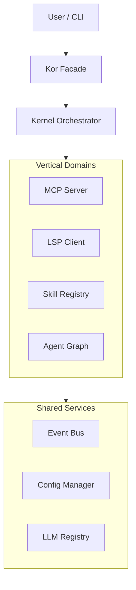

# KOR — The Developer Operating System

> **Build. Orchestrate. Scale.**  
> An extensible, vertical AI agent framework designed for the next generation of software engineering.

---

## ⚡️ Frictionless AI Development

KOR is designed to be **instant**. Forget complex setups.

### 1. Install

```bash
git clone https://github.com/felipepimentel/kor-sdk.git
cd kor-sdk
uv sync
```

### 2. Boot (Zero Config)

KOR runs in **Mock Mode** by default. You don't need an API key to see it in action.

```bash
uv run kor boot
uv run kor chat
```

### 3. Connect Real Intelligence

Ready to solve real problems? Connect your provider of choice.

```bash
# Example: Using OpenAI
uv run kor config set secrets.openai_api_key=sk-...
uv run kor config set llm.default.provider=openai
uv run kor config set llm.default.model=gpt-4o
```

---

## 🧩 Why KOR?

### 🏛️ Vertical Architecture

KOR is organized by **Domain**, not by layer.

- **MCP**: Full Model Context Protocol server/client.
- **LSP**: Integrated Language Server Protocol (Sense code like an IDE).
- **Skills**: Modular capabilities you can drop in and out.

### 🚀 Agentic Core

Built on **LangGraph**, KOR implements a robust Supervisor-Worker pattern.

- **Architect**: Plans systems.
- **Coder**: Writes code.
- **Reviewer**: Catch bugs.
- **Explorer**: Navigates the codebase using semantic graph search.

### 🔌 Ultimate Extensibility

Everything is a plugin.

- **Declarative Plugins**: Define tools in `plugin.json` and scripts. Zero Python boilerplate.
- **Deep Integration**: Subclass `KorPlugin` for full control over the specific kernel lifecycle hooks.

---

## 🛠️ CLI Commands

| Command | Description |
| :--- | :--- |
| `kor boot` | Initializes the Kernel, loads context, and prepares the mesh. |
| `kor chat` | Interactive session with the Agent Swarm. |
| `kor doctor` | Self-healing diagnostics to ensure your environment is perfect. |
| `kor new` | Scaffolds a new plugin or project in seconds. |
| `kor config` | Manages your environment configuration effortlessly. |

---

## 🏗️ Architecture at a Glance



See [ARCHITECTURE.md](ARCHITECTURE.md) for a deep dive.

---

## 🤝 Contributing

We are building the future of coding agents.
Check [AGENTS.md](AGENTS.md) to understand how to interact with this repository as an AI agent.

**License**: MIT
